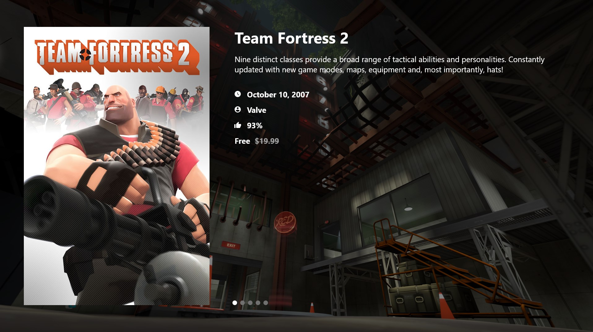

# Steam Game Viewer

A simple app for viewing Steam game store info.

Built with React and .NET.

## Getting Started

1. Start the API by opening `src/api/SteamGameViewer.sln` in Visual Studio and running SteamGameViewer.API.
2. Start the frontend by running `npm start` in `src/frontend`.
